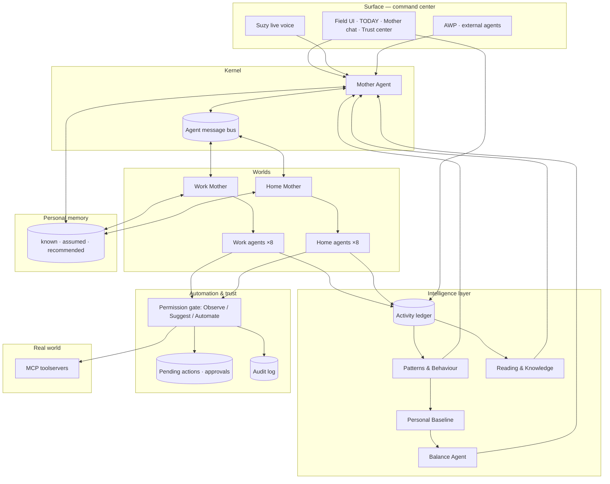
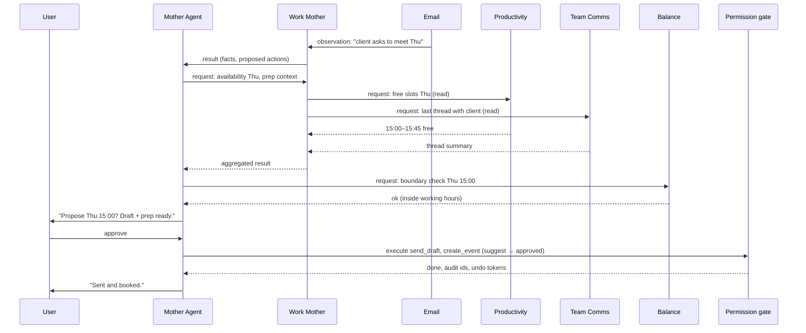
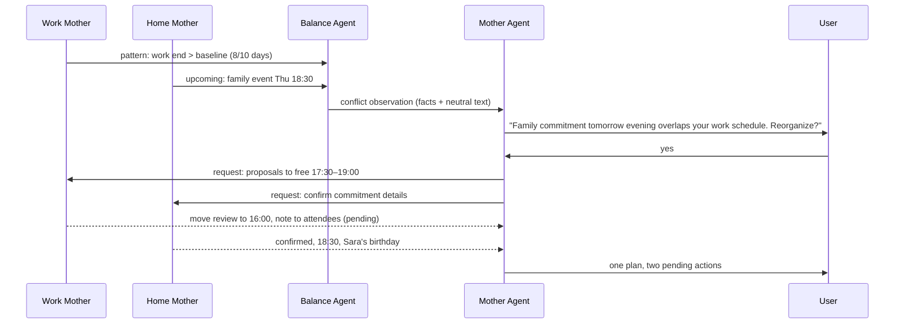

# Agentrix Personal AI OS — Concept & Architecture

**Working title:** Agentrix OS · Phase 2 — "One coordinated life"
**Status:** Concept v1.0 (for review)
**Date:** 2026-09-19
**Baseline codebase:** [zavora-ai/zavora-os](https://github.com/zavora-ai/zavora-os) @ `228ec78` (2026-06-23) — Rust/Axum + adk-rust, Gemini, MCP toolservers, AWP
**Companion document:** [`SPRINT_PLAN.md`](./SPRINT_PLAN.md) — the work below split into 13 sprints (S0–S12)
**Audience:** software engineers, product designers, AI researchers, investors, business stakeholders, future users

---

## How to read this document

| If you are… | Start with… |
|---|---|
| An investor or business stakeholder | §0 Executive summary, §1 Vision, §13 User journeys, §15 Future expansion |
| A product designer | §3 Mother Agent, §9 Balance system, §10 Automation layer, §13 User journeys, Appendix E (UI) |
| A software engineer | §2 System architecture, §6 Agent catalog, §7–§12, Appendices A–D, then `SPRINT_PLAN.md` |
| An AI researcher | §3, §7 Intelligence layer, §8 Personal baseline, §11 Memory architecture, §14 Agent-to-agent protocol |
| A future user | §1, §9, §10, §11, §13 |

Terminology: **Agentrix OS** is the product that exists today (the `spatial-os` crate). **Personal AI OS** is the Phase 2 target described here. **Suzy** is the existing coordinator persona and remains the voice of the **Mother Agent**.

---

## 0. Executive summary

Agentrix OS today is a working agentic prototype: a user speaks an intent, a Gemini-backed router picks one of seven scenarios (`morning`, `deck`, `lisbon`, `week`, `people`, `live`, `proactive`), a workflow of parallel and sequential sub-agents runs against real MCP toolservers (calendar, email, news, weather, Slack, CRM, banking, GitHub, maps, real estate, spreadsheets, documents, slides), and results bloom into spatial cards. Suzy summarizes. Three ambient agents work on a cron in the background. External agents can drive the same pipeline through the Agentic Web Protocol (AWP).

Phase 2 turns that prototype into a **Personal AI Operating System**. The change is structural, not cosmetic:

1. **One Mother Agent** replaces "router + summarizer". It holds the user's whole context, decides who acts, mediates between agents, detects conflicts, and speaks with one voice.
2. **Two worlds** — a **Work World** and a **Home World**, each with its own coordinating agent and specialized sub-agents — are logically separated but reconciled by the Mother Agent.
3. **An intelligence layer** learns a **Personal Baseline**, notices drift in routines, measures **Work/Home balance**, tracks reading and knowledge, and describes digital behaviour in neutral language.
4. **An automation layer** gives every agent one of three authority levels — **Observe, Suggest, Automate** — enforced at the tool boundary, with approvals, audit and undo.
5. **A personal memory** that separates **what the system knows**, **what it assumes**, and **what it recommends**, and that the user can read, edit, delete and export.
6. **Privacy as architecture**: domain-scoped data isolation, encrypted sensitive fields, consent records, retention rules, and audit logs, layered on the existing JWT auth, per-agent tool allowlists and AWP trust levels.

> **One person → One AI OS → One Mother Agent → Many specialized agents → One coordinated life.**

The goal is to help a person work better, live better, understand their own patterns, automate the repetitive, and keep a deliberate boundary between work and home — while staying in control.

---

## 1. Vision

### 1.1 The problem

People now run their lives through a dozen disconnected tools: work email, Slack, a work calendar, a personal calendar, banking apps, health trackers, family chats, social media, news, music. Each tool has its own notifications, its own "assistant", and no idea what the others are doing. The person is the only integration layer — and the person is tired.

AI chatbots do not fix this. A chatbot answers questions; it does not hold context across a life, it cannot act on the user's behalf safely, and it has no sense of when work is quietly eating the evening.

### 1.2 The shift: from chatbots to a coordinated OS

An operating system does three things a chatbot does not: it **owns the context**, it **schedules work across many processes**, and it **enforces permissions**. The Personal AI OS applies exactly those ideas to a person's digital life:

| OS concept | Personal AI OS equivalent |
|---|---|
| Kernel / scheduler | **Mother Agent** — routes, delegates, arbitrates, synthesizes |
| Processes | **Specialized agents** — one per life area, each with narrow tools |
| User space partitions | **Work World** and **Home World** — logically isolated, reconciled by the kernel |
| Telemetry | **Activity ledger** feeding the **Intelligence layer** |
| Permissions / capabilities | **Observe · Suggest · Automate** per agent, per tool effect |
| Filesystem the user owns | **Personal memory** — known / assumed / recommended, user-editable |
| Security model | Identity, encryption, allowlists, audit, consent, retention |

### 1.3 Design principles

1. **Orchestrate, don't chat.** The Mother Agent coordinates; it does not try to do everything itself.
2. **Two worlds, one life.** Work and Home stay separated by default; only the Mother Agent sees both.
3. **Inform and suggest, never control.** Observations are offered with a question, not a verdict.
4. **Neutral language.** "You have worked later than usual for two weeks" — never "you are overworking".
5. **Never assume why.** The system reports what changed and offers to help review; it does not diagnose causes.
6. **Least privilege everywhere.** Agents get only the tools and memory they need. Discovery ≠ exposure.
7. **Human in control.** Every external action has a permission level; the user can pause everything with one switch.
8. **Honest data.** No fabricated facts, no silent stubs — a rule Agentrix OS already enforces in its greeting agent and labeled stubs.
9. **Memory is the user's.** Readable, editable, deletable, exportable, with provenance.
10. **Health and money stay conservative.** Wellness agents organize and escalate; finance agents inform and never move money autonomously.

### 1.4 What Agentrix OS already proves

The current repository is a strong foundation, not a blank page:

- **Real multi-agent orchestration** with `ParallelAgent` → `SequentialAgent` workflows and shared state (`src/agents/morning.rs`, `deck.rs`, `week.rs`, …).
- **An LLM router** (`src/agents/router.rs`) and a **coordinator persona** (`src/agents/suzy.rs`) that composes summaries only from session facts.
- **Twelve-plus MCP toolservers** wired with **per-agent tool allowlists** (`mcp_allowlists.toml`, `src/tools/allowlist.rs`) — the seed of the permission system.
- **Ambient agents on cron** with a DND flag (`src/ambient/`) — the seed of the automation layer.
- **Persistence and identity**: Postgres sessions, JWT cookies, Google OAuth (`src/pg_session.rs`, `src/auth.rs`).
- **AWP**: trust levels, rate limits, capability gating, event subscriptions (`src/awp_gate.rs`, `business.toml`).
- **A live UI contract** over SSE (`src/events/sse.rs`) and a spatial card field with People/Family/Live/Agent rails — the Family rail and the "work vs family" split in `src/rails/background.rs` already hint at two worlds.
- **Live voice** (Gemini Live over WebSocket) with tool calls (`src/voice/realtime.rs`).

### 1.5 What changes in Phase 2

| Today (scenario tour) | Phase 2 (coordinated life) |
|---|---|
| Intent → one of 7 scenario keys | Intent → Mother Agent → world(s) → agent(s), possibly several in one turn |
| Suzy summarizes after cards resolve | Mother Agent plans, delegates, arbitrates, then Suzy-voice synthesizes |
| Agents grouped by demo scenario | Agents grouped by **life domain** (Work / Home) with a coordinating agent per world |
| Tool allowlists (which tools) | Allowlists **plus** authority modes (Observe / Suggest / Automate) and tool effect classes |
| Session state only | Session state **plus** activity ledger, baselines, observations, memory, audit |
| Three demo ambient agents | Intelligence layer on cron: patterns, baseline, balance, behaviour, knowledge |
| Greeting + morning brief | Full daily briefing across Work · Home · Learning · Wellbeing · Balance · Actions |
| Spatial card field | Card field **plus** TODAY command center, Mother chat, trust center (permissions, memory, audit) |

---

## 2. System architecture

### 2.1 The hierarchy

```
                              PERSONAL AI OS
                                    │
                        MOTHER AGENT  (Suzy voice)
              context · routing · delegation · arbitration · synthesis
                                    │
                 ┌──────────────────┴──────────────────┐
                 │                                     │
            WORK WORLD                            HOME WORLD
        Work Mother Agent                     Home Mother Agent
                 │                                     │
   ┌─────────────┼─────────────┐           ┌───────────┼───────────┐
   │             │             │           │           │           │
 Productivity  Email      Team Comms     Family    Personal    Health &
                                                  Productivity  Wellness
 Project       Career     Research &     Finance   AI Radio /  Social &
                          Knowledge                Entertain.  Fun
 Professional  Work                      Personal  Travel &
 Social Media  Automation                Social    Errands
                 │                                     │
                 └──────────────────┬──────────────────┘
                                    │
                           INTELLIGENCE LAYER
                    ┌───────────────┼───────────────┐
                    │               │               │
              Patterns &       Personal          Balance
              Digital          Baseline           Agent
              Behaviour            │
                    │      Reading & Knowledge   │
                    └───────────────┼───────────────┘
                                    │
                            PERSONAL MEMORY
                    known · assumed · recommended
                                    │
                           AUTOMATION LAYER
                    ┌───────────────┼───────────────┐
                 Observe         Suggest         Automate
                    └───────────────┼───────────────┘
                                    │
                             USER APPROVAL
                                    │
                    PRIVACY & SECURITY  (identity · encryption ·
                    allowlists · isolation · audit · consent · retention)
                                    │
                               REAL WORLD
              calendar · email · chat · banking · health · social · media
                            (MCP toolservers, AWP peers)
```

### 2.2 Layered view (Mermaid)



### 2.3 Layer responsibilities

| Layer | Responsibility | Exists today | Phase 2 change |
|---|---|---|---|
| **Surface** | Field UI, TODAY dashboard, Mother chat, trust center, voice, AWP | Field UI, greeting, voice, AWP | Add TODAY, chat panel, trust center; domain lenses |
| **Kernel — Mother Agent** | Context, routing, delegation, arbitration, synthesis | Router + Suzy summarizer | Single orchestrator agent with tools; message bus |
| **Worlds** | Coordinate one life domain each | Implicit (scenarios) | Explicit `work_mother`, `home_mother` agents |
| **Specialized agents** | One life area each, narrow tools | 20+ card agents + 3 ambient | Re-homed by domain; 8 new agents; agent contract |
| **Intelligence** | Ledger, patterns, baseline, balance, behaviour, knowledge | None (ambient research/scout/maker only) | New module on cron; deterministic stats + LLM phrasing |
| **Memory** | known / assumed / recommended, provenance, consent | Session state, `user:preferences` key | New store, API, tools, UI |
| **Automation & trust** | Modes, pending actions, approvals, audit, undo | Tool allowlists, commit endpoint, DND | Permission gate at tool boundary; pending actions; audit |
| **Privacy & security** | Identity, encryption, isolation, consent, retention | JWT/OAuth, artifact scoping, AWP trust, rate limits | Column encryption, consent persistence, retention jobs, domain isolation |
| **Integrations** | MCP toolservers, AWP peers | 14 MCP servers | Add contacts, tasks, media, social (gaps labeled) |

### 2.4 Mapping to the current repository

| Concept | Today's code | Phase 2 location (proposed) |
|---|---|---|
| Mother Agent | `src/agents/suzy.rs`, `src/agents/router.rs`, `src/orchestrator/coordinator.rs` | `src/mother/{agent,intake,delegate,synth}.rs` |
| Work / Home mothers | — (scenarios in `src/orchestrator/dispatch.rs`) | `src/worlds/{work,home}.rs` |
| Work agents | `agents/{calendar,inbox,people,week(focus),deck,ambient/research}.rs` | `src/agents/work/*.rs` |
| Home agents | `agents/{week(money,health),lisbon,live,ambient/maker}.rs`, family rail | `src/agents/home/*.rs` |
| Agent message bus | `AmbientStore` broadcast, adk shared state | `src/mother/bus.rs` |
| Activity ledger | `agent_events` table (raw adk events) | `src/intelligence/ledger.rs`, `activity_events` table |
| Patterns / Baseline / Balance / Behaviour / Knowledge | — | `src/intelligence/{patterns,baseline,balance,behavior,knowledge}.rs` |
| Personal memory | `user:preferences` in session state | `src/memory/`, `memory_items` table |
| Permission modes | `mcp_allowlists.toml` (tool names only) | `mcp_allowlists.toml` + `mode`/`effects`; `src/permissions/gate.rs` |
| Pending actions / approvals | `POST /api/sessions/{sid}/commit` (label → message) | `pending_actions` table, `routes/actions.rs` |
| Audit | tracing logs | `audit_log` table, `routes/audit.rs` |
| Daily briefing | `greeting/`, `agents/morning.rs`, `agents/brief.rs` | `src/briefing/`, `routes/briefing.rs` |
| Scheduling | `adk_agent::ambient::{AmbientAgent, CronTrigger}` | Reused for intelligence jobs and automation recipes |
| Consent | `InMemoryConsentService` (adk-awp) | Persisted `consents` table |
| External agents | `/awp/a2a` → `dispatch_intent` | `/awp/a2a` → Mother Agent |

### 2.5 Core runtime concepts

| Concept | Definition | Persistence |
|---|---|---|
| **User** | The single person the OS serves | `users` |
| **Session** | One device visit; cards, rails, artifacts | `ui_sessions`, `agent_sessions` |
| **Domain** | `work` · `home` · `shared` tag on every agent, card, event, memory item | Column on all Phase 2 tables |
| **Intent** | A user utterance (text or voice) or an external A2A message | `activity_events` (kind = `intent`) |
| **Delegation** | Mother → world → agent task with a trace id | `agent_messages` (optional), tracing |
| **Activity event** | Anything that happened: tool call, card resolve, approval, observation, user action | `activity_events` |
| **Baseline** | Rolling statistics of "normal" per dimension | `baselines` |
| **Observation** | A detected pattern, drift or imbalance offered to the user | `observations` |
| **Memory item** | A fact with kind `known` / `assumed` / `recommended` | `memory_items` |
| **Permission mode** | `observe` / `suggest` / `automate` per agent, overridable per tool | `agent_permissions` |
| **Pending action** | A proposed write action awaiting approval | `pending_actions` |
| **Audit entry** | Immutable record of any executed effect | `audit_log` |
| **Recipe** | A user-approved automation ("when X, do Y") | `automation_recipes` |

---

## 3. Mother Agent

> The user's primary AI companion and operating-system-level coordinator. Suzy is its voice.

### 3.1 Responsibilities

| Responsibility | How it is realized |
|---|---|
| Understand the user's overall context | Reads memory (known/assumed), today's baseline snapshot, open observations, active sessions, both worlds' status |
| Coordinate all specialized agents | Delegates through the Work/Home mothers; never calls a leaf agent's tools directly |
| Maintain unified priorities | Keeps a `priorities` view merged from Work Productivity and Home Personal Productivity, ranked with user-set weights |
| Decide which agent handles a task | Intake classifier → world(s) → agent(s); multi-agent fan-out when an intent spans domains |
| Delegate between agents | `AgentMessage` bus with trace ids; results flow back through the mothers |
| Combine information | Synthesis step composes **one** response from many agent outputs (existing Suzy summarizer, generalized) |
| Detect Work/Home conflicts | Consumes Balance Agent conflict observations; checks calendar overlaps across domains at delegation time |
| Identify routine changes | Consumes Personal Baseline drift observations; decides when and how to surface them |
| Learn preferences over time | Proposes `assumed` memory items; promotes to `known` only on user confirmation |
| Recommend while user stays in control | Every recommendation is a card or chat reply with explicit actions; writes go through the permission gate |
| Automate when authorized | Approves recipes only in `automate` mode; every run is audited |
| Alert when attention is required | `attention` cards and briefing "Needs you" section, rate-limited by quiet hours and DND |
| Protect the work/home boundary | Enforces protected personal time blocks; declines to schedule work into them without asking |

### 3.2 What the Mother Agent is not

- Not a chatbot that answers from its own knowledge. It answers from agents, memory and ledger facts, and says when it does not know.
- Not omnipotent. It has **no MCP tools of its own**. Its tools are internal: `get_context`, `delegate`, `read_memory`, `propose_memory`, `read_observations`, `compose`. This keeps the blast radius of a bad routing decision to "wrong agent asked", never "wrong email sent".
- Not a surveillance system. It sees aggregates and observations from the intelligence layer, not raw content from every agent, unless the user asks it to dig in.

### 3.3 Internal structure

```
                     ┌───────────────────────────────────────────────┐
  user / voice /     │                 MOTHER AGENT                  │
  AWP intent ───────▶│                                               │
                     │  1. INTAKE        classify: domain(s), agents,│
                     │                   urgency, action vs question │
                     │         │                                     │
                     │  2. CONTEXT       memory · baseline ·         │
                     │     ASSEMBLY      observations · session      │
                     │         │                                     │
                     │  3. DELEGATION    plan parallel / sequential  │
                     │     PLANNER       tasks per world; trace id   │
                     │         │                                     │
                     │  4. ARBITRATION   conflicts between results;  │
                     │                   boundary rules              │
                     │         │                                     │
                     │  5. SYNTHESIS     one answer in Suzy's voice; │
                     │     (Suzy)        actions carry their mode    │
                     │         │                                     │
                     │  6. ACTION GATE   observe / suggest /         │
                     │                   automate → pending or run   │
                     └───────────────────────────────────────────────┘
```

**Intake** keeps the current `LlmConditionalAgent` pattern (`src/agents/router.rs`) but classifies into a richer target than a scenario key:

```json
{
  "domains": ["work", "home"],
  "targets": [
    {"world": "work", "agent": "productivity", "task": "list today's priorities"},
    {"world": "home", "agent": "family",       "task": "list today's commitments"}
  ],
  "kind": "question",
  "urgency": "normal",
  "clarify": null
}
```

The seven existing scenario keys remain valid targets (`deck` → Work Automation, `morning` → Daily Briefing, `lisbon` → Travel, `week` → weekly review across both worlds, `people` → Team Comms + Family, `live` → Entertainment/News, `proactive` → "show me what you found") so the current tour keeps working during the transition.

**Context assembly** builds a compact, structured context block (never raw inboxes) — the same discipline the greeting agent already follows with `INTEGRATION_FACTS`.

**Delegation planner** emits `AgentMessage`s (§14) to the Work and Home mothers. Parallel by default; sequential when a task declares a dependency (the existing `waitsFor` semantics).

**Arbitration** applies boundary rules before synthesis:
- A work task may not be scheduled into a protected home block without asking.
- Two agents proposing conflicting actions (Email says "accept meeting", Balance says "evening is protected") produce **one** question to the user, not two cards.
- Health and finance results are passed through verbatim with their escalation/caution labels intact.

**Synthesis** is the existing `suzy_coordinator` instruction generalized: 2–4 sentences, `<b>` for key facts, and a list of actions each tagged with its permission mode so the UI can render "Will do" vs "Suggest" vs "Watching".

### 3.4 Implementation notes (adk-rust)

- `mother_agent` is an `LlmAgent` whose toolset is an internal `MotherToolset` (no MCP). Tools return JSON from `MemoryService`, `LedgerService`, `ObservationService`, and `SessionStore`.
- `delegate` is a tool that publishes to the bus and awaits results with a timeout; each result becomes a `card_*` SSE event exactly as today's workflow streamer (`src/orchestrator/workflow.rs`) does.
- The Mother Agent runs with a small, fast model for intake and synthesis; leaf agents keep their own model config. Budgeting is per turn (see `SPRINT_PLAN.md` S12).
- Voice: `src/voice/realtime.rs` already exposes `submit_intent` and `get_session_context` to Gemini Live; Phase 2 points those at the Mother Agent so voice and text share one brain.

### 3.5 Chat surface

The Mother Agent is always one sentence away. Example prompts and their routing:

| User says | Intake result | Who answers |
|---|---|---|
| "What do I need to know today?" | question · both worlds | Daily briefing workflow (§13.1) |
| "Prepare me for my afternoon." | question · work + home · time-boxed | Work Productivity + Team Comms (meeting prep) + Family (evening) |
| "What's happening with work?" | question · work | Work Mother fan-out: Productivity, Email, Team, Project |
| "Remind me about family commitments." | question · home | Family Agent |
| "I'm overwhelmed. Help me reorganize today." | action · both worlds · suggest | Productivity agents propose a re-plan; Balance adds protected time; Mother presents one plan for approval |
| "What have I been reading lately?" | question · shared | Reading & Knowledge Agent |

---

## 4. Work World

**Work Mother Agent** (`work_mother`) coordinates everything professional. It owns the work calendar, work identities (work email, Slack, GitHub, CRM, LinkedIn) and work memory scope. It receives delegations from the Mother Agent, fans out to its sub-agents, merges their results, and returns one structured result.

Default posture: **Suggest** for anything that leaves the machine (send, post, schedule with others); **Automate** allowed for internal organization (labels, task creation, summaries) once the user opts in.

| Sub-agent | Mission | Data sources (MCP) | Today | Default mode |
|---|---|---|---|---|
| **Productivity** | Tasks, to-dos, calendar, meetings, deadlines, planning, reminders, time management, focus sessions, daily/weekly plan | `mcp-calendar` (work calendar), new `tasks` store | `calendar_agent` (Today card) | Suggest (Automate for reminders and task creation) |
| **Email** | Read & categorize, draft replies, summarize threads, flag urgent, track unanswered, schedule sends, detect important communication | `mcp-email` | `inbox_agent` (Needs you card; `create_draft`) | Observe → Suggest (drafts); `send_*` never below Suggest |
| **Team Communication** | Slack/Teams/Discord: channel monitoring, mentions, summaries, follow-ups, meeting coordination, 1:1 prep | `mcp-slack`, `mcp-calendar` | `team_agent`, `priya_agent` | Observe → Suggest |
| **Professional Social Media** | LinkedIn and professional communities: mentions, post suggestions, content calendar, interactions, networking opportunities | *gap:* LinkedIn MCP; interim: manual import / labeled stub | — | Observe; Suggest for posts |
| **Project** | Status, tasks, docs, milestones, responsibilities, risks, dependencies, progress reports | `mcp-github`, `mcp-slack`, `mcp-crm`, docs artifacts | `focus_agent` (GitHub), deck agents for reports | Observe → Suggest |
| **Career** | Goals, skills, opportunities, CV, certifications, learning plans, networking | memory (goals), Reading & Knowledge, `mcp-crm`/LinkedIn (gap) | — | Observe → Suggest |
| **Research & Knowledge** | Research, reading, documentation, knowledge organization, summaries, personal knowledge management | `mcp-news` (`search_news`, `arxiv_search`), `mcp-search` (optional), artifacts | `research_agent` (ambient) | Observe; Automate for scheduled briefs |
| **Work Automation** | Detect repetitive professional tasks, propose recipes, run authorized automations, build documents/decks/reports | ledger (patterns), `worksheet-mcp`, `docx-mcp`, `slides-mcp` | deck workflow (`excel/docs/slides/combine`), ambient cron infra | Suggest → Automate per recipe |

Work World also hosts the **professional relationship** capability today provided by `connections_agent` (CRM). In Phase 2 it lives inside Team Communication (colleagues) and Career (network).

---

## 5. Home World

**Home Mother Agent** (`home_mother`) coordinates personal, family, social and everyday life. It owns the personal calendar, personal contacts, personal finance, health imports, media preferences, and home memory scope.

Default posture: **Observe** for anything sensitive (health, money, social accounts); **Suggest** for reminders and plans; **Automate** only for low-risk conveniences the user explicitly enables (start the morning playlist, add recurring household tasks).

| Sub-agent | Mission | Data sources (MCP) | Today | Default mode |
|---|---|---|---|---|
| **Family** | Family communication, important dates, birthdays, events, household coordination, reminders, shared responsibilities, planning | `mcp-calendar` (shared/family calendar), contacts (*gap:* contacts MCP; interim: CSV/vCard import), WhatsApp (gap) | Family rail (empty state), `connections_agent` birthday line | Observe → Suggest |
| **Personal Productivity** | Personal tasks, calendar, errands, reminders, projects, routines, goals | `mcp-calendar` (personal), `tasks` store, `mcp-maps` (errand routing) | — (calendar agent is work-scoped) | Suggest; Automate for reminders |
| **Health & Wellness** | Exercise routines, sleep patterns, wellness habits, appointments, medication reminders, healthy routines. **Never diagnoses; escalates to professionals.** | HealthKit/CSV import (BK-010), `mcp-calendar` (appointments) | `health_agent` (CSV) | Observe; Suggest for reminders only |
| **Personal Social Media** | Instagram, Facebook, TikTok, X, WhatsApp: content organization, posting assistance, notifications, interactions, presence monitoring, content planning | *gap:* no social MCPs; interim: notification/export import, labeled stub | Live "Now" card mentions X | Observe; Suggest for posts |
| **AI Radio / Entertainment** | Music, podcasts, news, audiobooks, personalized radio, recommendations, commute listening, background audio. Learns taste without being intrusive. | `mcp-news` (headlines, HN, sports), media MCP (*gap*; optional `media-mcp`) | `headlines_agent`, `now_agent`, Live rail, `maker_agent` playlists | Observe → Suggest; Automate "start my morning audio" opt-in |
| **Personal Finance** | Budgets, spending organization, bills, savings goals, subscriptions, reminders, household expenses. **Information and organization only.** | `mcp-banking` | `money_agent` | Observe; Suggest for reminders/categorization; **no money movement** |
| **Social & Fun** | Jokes, games, conversation, entertainment, memes, fun recommendations, social ideas, weekend activities | LLM + `mcp-news`, `mcp-maps` (places), `mcp-weather` | `maker_agent` | Suggest |
| **Travel & Errands** *(inherited)* | Trip planning, itineraries, stays, routes | `mcp-maps`, `mcp-weather`, `mcp-real-estate`, travel MCP (gap BK-009) | `planner_agent`, `stay_agent`, `flights_agent` (stub) | Suggest |

---

## 6. Specialized agents

### 6.1 Agent contract

Every specialized agent, in either world, implements the same contract. This is what makes the system an OS rather than a pile of bots.

```toml
# agents/<world>/<agent>.toml  (declarative half; the Rust half builds the LlmAgent)
id          = "email"
world       = "work"                      # work | home | shared
mission     = "Keep the user's professional inbox understood and answered."
mcp_servers = ["email"]
mode        = "suggest"                   # observe | suggest | automate (user-overridable)
memory_scope = ["work.contacts", "work.preferences.email"]
emits       = ["card", "observation", "memory_proposal", "pending_action"]
escalation  = "none"                      # none | human_professional (health) | user_only (finance)

[tools]                                   # effect classes drive the permission gate
list_inbox      = "read"
search_emails   = "read"
get_email       = "read"
create_draft    = "write_local"
send_draft      = "send_external"
reply_to_email  = "send_external"
```

| Contract element | Meaning |
|---|---|
| **Identity** | Stable `id`, `world`, glyph, display name (cards, rails, audit all use it) |
| **Mission** | One sentence; used in the agent's system prompt and in the trust center UI |
| **Inputs** | Delegation message from its world mother; scoped memory; ledger slices it is allowed to see |
| **Tools** | MCP allowlist (exists today) **plus** an effect class per tool: `read`, `write_local`, `send_external`, `schedule_with_others`, `financial`, `publish_public` |
| **Outputs** | `card` (resolve payload as today), `observation`, `memory_proposal` (always `assumed`), `pending_action` |
| **Mode** | Observe / Suggest / Automate; the gate enforces it per tool effect (§10) |
| **Escalation** | Health: escalate to human professionals; Finance: never autonomous money movement |
| **Ledger** | Every tool call and result summary is written to `activity_events` with domain and effect |

### 6.2 Catalog

| Agent id | World | Status | Primary MCP | Gap / note |
|---|---|---|---|---|
| `mother` | shared | **new** (from `suzy` + `router`) | none (internal tools) | — |
| `work_mother` | work | **new** | none | — |
| `home_mother` | home | **new** | none | — |
| `productivity` | work | extend `calendar_agent` | calendar | needs `tasks` store |
| `email` | work | extend `inbox_agent` | email | send gated at Suggest |
| `team_comms` | work | extend `team_agent` + `priya_agent` | slack, calendar | Teams/Discord adapters later |
| `professional_social` | work | **new** | — | LinkedIn MCP gap; labeled stub |
| `project` | work | extend `focus_agent` | github, slack, crm | — |
| `career` | work | **new** | memory, crm | LinkedIn gap |
| `research_knowledge` | work | extend ambient `research_agent` | news, search | `mcp-search` optional |
| `work_automation` | work | extend deck agents + ambient infra | worksheet, docx, slides | recipes engine new |
| `family` | home | **new** (family rail exists) | calendar, contacts | contacts MCP gap; WhatsApp gap |
| `personal_productivity` | home | **new** | calendar, maps | shares `tasks` store |
| `health_wellness` | home | extend `health_agent` | CSV/HealthKit | wearable MCP gap (BK-010) |
| `personal_social` | home | **new** | — | social MCP gap; labeled stub |
| `entertainment` | home | extend `headlines/now/markets` + `maker` | news, media (opt.) | media MCP gap |
| `finance` | home | extend `money_agent` | banking | read-only tools only |
| `social_fun` | home | extend `maker_agent` | news, maps, weather | — |
| `travel` | home | keep `planner/stay/flights` | maps, weather, real_estate | travel MCP gap (BK-009) |
| `patterns` | intelligence | **new** | ledger | deterministic |
| `baseline` | intelligence | **new** | ledger | deterministic |
| `balance` | intelligence | **new** | ledger, calendars | — |
| `digital_behavior` | intelligence | **new** | ledger | — |
| `reading_knowledge` | intelligence | **new** | ledger, news, artifacts | knowledge graph store |
| `briefing` | shared | extend `morning` + `greeting` | all via mothers | — |

### 6.3 Agent lifecycle and rails

The existing rails map cleanly onto the OS view:

| Rail (today) | Phase 2 meaning |
|---|---|
| **Active** | Agents currently executing a delegation |
| **Resting** (fling/snooze) | Agents the user paused for this session; wake re-queues the delegation |
| **Proactive** | Automate-mode agents and intelligence jobs on cron |
| **People** (work / family) | Team Communication and Family agents' live presence — the two worlds made visible |
| **Live** | Entertainment/News agent's feed |

Each agent tile gains a **domain colour** (work / home / shared) and a **mode badge** (👁 Observe · 💡 Suggest · ⚡ Automate).

---

## 7. Intelligence layer

The intelligence layer sits above both worlds. It observes **patterns across Work and Home** without reading raw content, respects user permissions and privacy, and produces **observations** the Mother Agent may surface. It is deliberately boring in implementation: deterministic statistics first, an LLM only to phrase the result in neutral language.

### 7.1 The activity ledger (foundation)

Everything the intelligence layer knows comes from one append-only table. Agents write to it through the permission gate; the UI writes user interactions; nothing else is scraped.

```sql
CREATE TABLE activity_events (
  id           BIGSERIAL PRIMARY KEY,
  user_id      UUID        NOT NULL,
  ts           TIMESTAMPTZ NOT NULL DEFAULT NOW(),
  domain       TEXT        NOT NULL,           -- work | home | shared
  agent_id     TEXT        NOT NULL,           -- email, family, mother, ui, ...
  kind         TEXT        NOT NULL,           -- intent | tool_call | card_resolve | approval |
                                               -- rejection | observation | task_postponed |
                                               -- reading | session_focus | notification | ...
  effect       TEXT,                           -- read | write_local | send_external | ...
  duration_ms  INTEGER,
  subject_hash TEXT,                           -- HMAC of the subject (thread id, task id) — no content
  meta         JSONB       NOT NULL DEFAULT '{}',  -- small, schema-checked, content-free
  trace_id     UUID
);
CREATE INDEX ON activity_events (user_id, ts);
CREATE INDEX ON activity_events (user_id, domain, kind, ts);
```

Rules:
- **No content in the ledger.** Subjects are hashed; `meta` holds counts, categories and durations, never bodies.
- **Domain is mandatory.** This is what makes the Balance Agent possible.
- **Retention is a policy** (§12): default 180 days raw, aggregates kept longer.

### 7.2 Pattern Recognition Agent

Runs nightly (and incrementally every 30 minutes for intraday signals) over the ledger. Pure aggregation.

| Pattern | Computed from | Output dimension |
|---|---|---|
| Working hours | first/last `work` events per day, calendar working blocks | `work.start`, `work.end`, `work.minutes` |
| Reading habits | `reading` events (Reading & Knowledge) | `reading.minutes`, `reading.sessions` |
| Communication patterns | `email`/`team_comms`/`family` counts, reply latency (hashed subjects) | `comms.work.volume`, `comms.family.volume`, `comms.reply_latency` |
| Productivity patterns | tasks completed vs created, focus session durations | `tasks.completed`, `focus.minutes` |
| Social media usage | `personal_social` observe events (when connected) | `social.minutes` |
| Sleep / routine | Health imports, first/last device activity | `sleep.hours`, `routine.first_activity` |
| Repeated tasks | same `subject_hash` recurring across days | candidates for Work Automation recipes |
| Frequently postponed tasks | `task_postponed` count per subject | list for Balance/Mother |
| Changes in normal behaviour | any dimension vs baseline (§8) | drift observations |

### 7.3 Reading & Knowledge Agent

Understands what the user reads, how often, which topics recur, and where interest is growing. Sources: news/article opens from the Entertainment agent, research briefs, saved documents and artifacts, optional imports (browser reading list, Kindle highlights CSV).

Output is a **personal knowledge graph**:

```
(Topic) ─read─▶ (Item: article/book/paper)      weight = recency × frequency
(Topic) ─relates─▶ (Project)                    from Project agent
(Topic) ─relates─▶ (Person)                     from Team/Family (hashed unless known contact)
(Topic) ─supports─▶ (Career goal)               from Career agent / memory
```

Queries the Mother Agent can make: "topics trending up for this user in 30 days", "items related to project X", "what did I read last week". Learning progress feeds the briefing's **Learning** section and the Career agent's plans.

### 7.4 Balance Agent

Compares Work and Home activity and identifies possible imbalance. Detailed in §9. It **informs and suggests**, never controls.

### 7.5 Digital Behavior Agent

Identifies, in neutral terms:

| Signal | Definition (default thresholds, all user-tunable) |
|---|---|
| Excessive context switching | > N domain/agent switches per hour across sessions |
| Notification overload | attention cards + external notifications > N per hour |
| Long uninterrupted work | `work` activity > 120 min with no break event |
| Repeated distractions | social/entertainment events inside declared focus blocks |
| Excessive social consumption | `social.minutes` > baseline + 2σ for 3+ days |
| Unusual routine change | any baseline drift (§8) |

### 7.6 Neutral language guidelines

All intelligence output passes through a phrasing step bound by these rules (enforced by prompt and by a small lint on the output):

| Do | Don't |
|---|---|
| "You've worked past 19:00 on 8 of the last 10 workdays; your usual is 17:30." | "You're overworking." |
| "Three personal tasks have been moved four times." | "You keep procrastinating." |
| "Family messages were fewer than usual this week." | "You've been neglecting your family." |
| "Would you like me to help you review what's changed?" | "You should stop working late." |
| State the number, the period, and the baseline. | Guess the cause, attach a mood, or moralize. |

### 7.7 Implementation

- Module `src/intelligence/` with `ledger.rs` (write API + query helpers), `patterns.rs`, `baseline.rs`, `balance.rs`, `behavior.rs`, `knowledge.rs`, `phrasing.rs`.
- Jobs run on the existing `AmbientAgent` + `CronTrigger` infrastructure (`src/ambient/service.rs`), so DND and quiet hours already apply.
- Statistics are computed in SQL/Rust; the LLM sees only the computed facts and the neutral-language rules — the same "facts in, prose out" pattern as `greeting/agent.rs`.
- Observations are stored, deduplicated by (dimension, window), cooled down (default: one observation per dimension per 7 days), and surfaced by the Mother Agent at appropriate moments (briefing, or when the user asks), never as interrupting pop-ups.

---

## 8. Personal Baseline — "going off the book"

### 8.1 Concept

The system gradually learns what is **normal for this user**, per dimension, and flags meaningful deviations. It does not assume why. It asks whether the user wants to review.

```
Normal (learned, then confirmed by the user)
  Work:                 09:00 – 17:30, Mon–Fri
  Reading:              ~30 min, evenings
  Exercise:             3× per week
  Family communication: regular (daily message activity)
  Sleep routine:        relatively consistent (±45 min)

Observed (last 14 days)
  Work end:             19:20 median  (+110 min)
  Reading:              9 min/day     (−70 %)
  Exercise:             1× per week
  Family communication: −40 %

→ Observation (drift, several dimensions, 14-day window)
  "Your routine has changed over the last two weeks. You've been working
   later than usual and spending less time on your personal activities.
   Would you like me to help you review what's changed?"
```

### 8.2 Learning model

| Element | Default | Notes |
|---|---|---|
| Warm-up | 14 days before any drift observation | The UI shows "learning your routine — 9 of 14 days" |
| Baseline window | rolling 28 days, weekday/weekend separated | Median + MAD (robust to a few late nights) |
| Comparison window | last 7 and last 14 days | Two windows avoid reacting to a single busy week |
| Deviation | \|median_recent − median_baseline\| > max(k·MAD, floor) | k = 2.5; floors per dimension (e.g. 45 min for work end) |
| Meaningful | ≥ 2 dimensions drifting, or 1 dimension for ≥ 10 days | Prevents noise |
| Cooldown | 7 days per dimension | No nagging |
| Confirmation | "Is this your usual routine?" once warm-up ends | Confirmed values become **known** memory; unconfirmed stay **assumed** |
| Reset | User can re-learn after a life change (new job, baby, move) | Explicit action in the trust center |

### 8.3 Data model

```sql
CREATE TABLE baselines (
  user_id    UUID NOT NULL,
  dimension  TEXT NOT NULL,        -- work.end, reading.minutes, exercise.weekly, ...
  day_class  TEXT NOT NULL,        -- weekday | weekend
  median     DOUBLE PRECISION,
  mad        DOUBLE PRECISION,
  sample_n   INTEGER,
  window_end DATE NOT NULL,
  confirmed  BOOLEAN NOT NULL DEFAULT FALSE,   -- user said "yes, that's my normal"
  PRIMARY KEY (user_id, dimension, day_class, window_end)
);

CREATE TABLE observations (
  id          UUID PRIMARY KEY,
  user_id     UUID NOT NULL,
  kind        TEXT NOT NULL,       -- drift | balance | behavior | pattern | conflict
  dimensions  TEXT[] NOT NULL,
  window_days INTEGER NOT NULL,
  facts       JSONB NOT NULL,      -- numbers only; the phrasing step reads this
  text        TEXT NOT NULL,       -- neutral-language sentence(s)
  offer       TEXT,                -- "Would you like me to help you review what's changed?"
  status      TEXT NOT NULL DEFAULT 'new',  -- new | shown | accepted | dismissed | snoozed
  created_at  TIMESTAMPTZ NOT NULL DEFAULT NOW(),
  shown_at    TIMESTAMPTZ,
  resolved_at TIMESTAMPTZ
);
```

### 8.4 The self-awareness loop

1. Baseline job computes stats nightly.
2. Drift detector emits an `observation` (kind `drift`) with facts and neutral text.
3. Mother Agent decides **when** to show it: in the next briefing, or when the user asks "how am I doing?", never mid-task.
4. The user can **accept** ("yes, help me review"), **dismiss**, **snooze**, or **correct** ("this is my new normal" → baseline re-learn).
5. Accepting opens a review: the Mother Agent asks Work Productivity and Home Personal Productivity for the concrete changes (later meetings, postponed tasks), and offers actions — each through the permission gate.

This is a **self-awareness layer**, not surveillance: the user sees exactly which dimensions are tracked, can turn any off, and can delete the ledger.

---

## 9. Balance system

### 9.1 What the Balance Agent measures

| Measure | Definition |
|---|---|
| **Attention share** | minutes of `work` vs `home` activity per day and per week (from the ledger, not from screen time alone) |
| **Boundary crossings** | work events inside protected home blocks; home events inside declared focus blocks |
| **Spillover** | work activity after `work.end` baseline; weekend work |
| **Postponement debt** | personal tasks postponed ≥ 3 times; work tasks likewise |
| **Family/social cadence** | family and personal communication volume vs baseline |
| **Recovery signals** | reading, exercise, sleep dimensions vs baseline (from Health & Wellness, observe-only) |

The output is not a single "score" shown as a judgement. It is a small set of facts and, when warranted, one observation with an offer.

### 9.2 Example observations

> "You've spent significantly more time on work-related activities this week than usual — about 11 hours more than your 4-week average."

> "You have three unfinished personal tasks that have been repeatedly postponed: renew passport, book dentist, call the plumber."

> "Your schedule is relatively work-heavy today: 7.5 hours of meetings and one personal commitment at 18:00."

### 9.3 Conflict detection (Work ↔ Home)

The Balance Agent is the only component that routinely looks at both calendars. When it finds an overlap or a likely spillover into a home commitment, it emits a `conflict` observation. The Mother Agent turns it into **one** question:

> "You have a family commitment tomorrow evening at 18:30, but your current work schedule extends into that period (a review is booked 17:30–19:00). Would you like me to help reorganize your tasks?"

Accepting delegates to Work Productivity (propose moving the review or a non-urgent task) and Family (confirm the commitment). Proposals return as **Suggest**-mode pending actions.

### 9.4 Boundaries the user can declare

| Boundary | Effect |
|---|---|
| **Working hours** | Outside them, work agents run in Observe mode by default and do not create attention cards (they queue for the morning) |
| **Protected time** (dinner, kids' bedtime, Sunday) | Mother Agent will not schedule work into it without asking; Balance flags any spillover |
| **Quiet hours** | No attention cards, no voice, no push; briefing waits |
| **Focus blocks** | Home/social agents pause notifications; Digital Behavior counts interruptions |
| **DND** | Existing flag; everything proactive pauses |

### 9.5 Tone

The Balance Agent uses the §7.6 rules. It never says "too much", "should", or "unhealthy". It reports differences from the user's own baseline and offers help.

---

## 10. Automation layer

The system does not only inform. It takes **authorized** actions. Authorization is explicit, per agent, and enforced where it matters: at the tool call.

### 10.1 Three levels

| Level | Meaning | Tool effects allowed | UI |
|---|---|---|---|
| **Observe** | Analyze, summarize, propose memory, emit observations. Cannot change anything outside the OS. | `read` only | 👁 badge; cards show facts and "Suggest actions?" |
| **Suggest** | Prepare an action and wait for approval. | `read`; `write_local` (drafts, artifacts) immediately; all other effects create a **pending action** | 💡 badge; approval inbox; card buttons "Approve / Edit / Reject" |
| **Automate** | Perform predefined actions automatically, within the agent's recipes and effect ceiling. | as configured per recipe; `financial` and `publish_public` always excluded from Automate | ⚡ badge; audit feed; "Undo" where reversible |

### 10.2 Effect classes

Every tool in `mcp_allowlists.toml` gains an effect. The gate decides by effect, not by tool name, so new MCP servers slot in without new rules.

| Effect | Examples | Observe | Suggest | Automate |
|---|---|---|---|---|
| `read` | `list_inbox`, `get_today`, `list_transactions` | ✅ | ✅ | ✅ |
| `write_local` | `create_draft`, `save_presentation`, `create_task` | ❌ | ✅ immediate | ✅ |
| `schedule_with_others` | `create_event` with attendees, `send_meeting_invite` | ❌ | pending | ✅ if recipe allows |
| `send_external` | `send_draft`, `reply_to_email`, Slack `send_message` | ❌ | pending | ✅ if recipe allows |
| `publish_public` | LinkedIn/X/Instagram post | ❌ | pending | ❌ never |
| `financial` | transfers, payments, purchases | ❌ | pending (with confirmation code) | ❌ never |
| `delete` | archive/delete mail, remove events | ❌ | pending | ✅ if recipe allows and reversible |

### 10.3 Where the gate lives

Agentrix OS already wraps toolsets (`GeminiSanitizedToolset`, `FilteredToolset` in `src/agents/gemini.rs`). The permission gate is one more wrapper:

```
LlmAgent ──▶ PermissionGate(agent_id, mode, effects) ──▶ FilteredToolset ──▶ MCP
                    │
                    ├─ read ..................... pass through, log
                    ├─ write_local .............. pass through if mode ≥ suggest, log
                    ├─ other effects ............ mode = automate & recipe allows → run, audit, undo token
                    │                             mode = suggest → enqueue pending_action, return
                    │                                "queued for approval" to the LLM
                    └─ mode = observe & effect ≠ read → return "not permitted in observe mode"
```

The agent's prompt is told which mode it is in, so it plans accordingly ("draft and queue" rather than "send").

### 10.4 Approval flow

```
agent proposes ──▶ pending_actions row ──▶ SSE permission_request ──▶ card / approval inbox
                                                                        │
                       ┌────────────────────────────────────────────────┤
                       ▼                        ▼                        ▼
                   Approve                    Edit                    Reject
                execute via gate      re-run agent with edits     mark rejected; agent
                audit + undo token    → new pending action        learns (assumed memory)
```

- `POST /api/actions/{id}/approve | reject | edit` (extends today's `POST /api/sessions/{sid}/commit`).
- Approvals can be **batch** ("approve all 4 drafts").
- Pending actions expire (default 48 h) and are summarized in the next briefing.
- Undo: where the MCP tool has an inverse (unarchive, delete event just created, recall draft), the audit entry stores an undo token valid for a window.

### 10.5 Automation recipes

The **Work Automation Agent** (and Home Personal Productivity for household routines) turns repeated patterns into recipes the user approves once:

```yaml
recipe: archive-newsletters
owner_agent: email
trigger: cron "0 */30 * * * *"
condition: sender in known_newsletter_senders and unread > 2 days
action: archive (effect: delete, reversible)
mode: automate
approved_by_user: 2026-10-14
undo_window: 7d
```

Examples the system may propose after observing repetition:
- Schedule meetings from email requests (Suggest → Automate for known colleagues)
- Weekly status report draft every Friday 16:00 (Work Automation + docx)
- Create tasks from starred Slack messages
- Set medication and appointment reminders (Health & Wellness, reminders only)
- Weekly shopping list from recurring household items (Family)
- Start the morning briefing audio at the usual commute time (Entertainment)
- Prepare the daily briefing at 07:15 (Mother)

Every recipe run writes an audit entry; the trust center shows "what ran while you were away" — the Phase 2 form of today's "Show me what you found".

### 10.6 Two kinds of trust, side by side

| | Internal authority (this section) | External trust (exists: AWP) |
|---|---|---|
| Who | The user's own agents | External agents calling `/awp/a2a` |
| Levels | Observe / Suggest / Automate | Anonymous / Known / Partner |
| Enforced at | Tool boundary (`PermissionGate`) | Route boundary (`AwpGate`, `business.toml` access levels) |
| Example | Email agent may draft but not send | Anonymous caller may submit an intent but not commit an action |

Both remain. An external agent (say, a company's scheduling bot) reaching the Mother Agent still sees only Suggest-mode outcomes unless the user has granted more.

### 10.7 Global controls

- **Pause everything**: one switch sets all agents to Observe and stops cron (extends DND).
- **Per-world pause**: "Work is off until Monday 09:00."
- **Per-agent mode**: trust center slider per agent; per-tool overrides for power users.
- **Kill a pending action** from any surface, including voice ("don't send that").

---

## 11. Memory architecture

### 11.1 Three kinds of memory, always labeled

| Kind | Meaning | How it gets there | Shown as |
|---|---|---|---|
| **Known** | The user said it, confirmed it, or it comes from a connected source the user authorized | User statement in chat; confirmation of an assumed item; integration facts (calendar events, contacts) | "You told me…" / "From your calendar…" |
| **Assumed** | The system inferred it from patterns | Intelligence layer, agents' `memory_proposal` outputs | "I think… (based on 3 weeks of activity)" with a **Confirm / Correct / Forget** control |
| **Recommended** | A suggestion the system is currently making | Mother Agent synthesis, Balance offers, recipes awaiting approval | "I suggest…" with **Accept / Not now / Never** |

The Mother Agent's prompts require it to cite the kind when it uses a memory item ("Since you prefer no meetings before 10 (you told me)…"). This is the practical form of "distinguish what it knows, assumes, recommends".

### 11.2 Scopes and layers

```
┌─────────────────────────────────────────────────────────────┐
│  PROFILE           name, timezone, home location, languages  │  known
├─────────────────────────────────────────────────────────────┤
│  PREFERENCES       work.email.tone, home.audio.morning,      │  known / assumed
│                    communication style, quiet hours          │
├─────────────────────────────────────────────────────────────┤
│  GOALS & PROJECTS  career goals, personal goals, projects    │  known
├─────────────────────────────────────────────────────────────┤
│  PEOPLE & DATES    family members, close contacts,           │  known (imported / stated)
│                    birthdays, anniversaries                  │
├─────────────────────────────────────────────────────────────┤
│  ROUTINES          baselines (confirmed → known)             │  assumed → known
├─────────────────────────────────────────────────────────────┤
│  KNOWLEDGE GRAPH   topics, items, relations                  │  assumed (derived)
├─────────────────────────────────────────────────────────────┤
│  EPISODIC          activity ledger, observations, audit      │  facts (not "memory" in UI)
├─────────────────────────────────────────────────────────────┤
│  SESSION           cards, rails, artifacts (exists today)    │  ephemeral / per device
└─────────────────────────────────────────────────────────────┘
```

Every item carries a **domain scope** (`work`, `home`, `shared`). Home agents cannot read `work.*` items and vice versa; only the Mother Agent and the Balance Agent read across, and only through the scoped API.

### 11.3 Data model

```sql
CREATE TABLE memory_items (
  id           UUID PRIMARY KEY,
  user_id      UUID NOT NULL,
  domain       TEXT NOT NULL,               -- work | home | shared
  category     TEXT NOT NULL,               -- profile | preference | goal | project | person | date |
                                            -- routine | interest | context | communication
  key          TEXT NOT NULL,               -- e.g. preference.meetings.earliest_start
  value        JSONB NOT NULL,              -- encrypted at rest when sensitivity ≥ sensitive
  kind         TEXT NOT NULL,               -- known | assumed | recommended
  confidence   REAL,                        -- for assumed items
  sensitivity  TEXT NOT NULL DEFAULT 'normal',  -- normal | sensitive | health | financial
  source_agent TEXT NOT NULL,               -- who wrote it
  provenance   JSONB NOT NULL,              -- {"kind":"user_statement","session":…} or {"kind":"pattern","observation_id":…}
  consent_id   UUID,                        -- link to the consent that permits storing this category
  created_at   TIMESTAMPTZ NOT NULL DEFAULT NOW(),
  updated_at   TIMESTAMPTZ NOT NULL DEFAULT NOW(),
  expires_at   TIMESTAMPTZ,                 -- retention policy or user-set
  deleted_at   TIMESTAMPTZ,                 -- soft delete; hard-purged by retention job
  UNIQUE (user_id, domain, key)
);
```

### 11.4 Operations

| Operation | Who | Path |
|---|---|---|
| Read scoped memory | Agents (own scope), Mother/Balance (cross-scope) | `MemoryService::read(scope, keys)` — never a raw table read |
| Propose | Any agent | `propose_memory` tool → creates **assumed** item; never `known` |
| Confirm / correct / forget | User only | Trust center, chat ("yes, that's right" / "no, I stop at 6" / "forget that") |
| Promote | System on user confirmation | assumed → known, provenance appended |
| Explain | User | "Why do you think that?" → provenance chain (observation → facts → ledger window) |
| Export | User | `GET /api/memory/export` (JSON), includes provenance |
| Delete all | User | `DELETE /api/memory` + ledger purge; account deletion cascades |

### 11.5 Principles

- **User-controlled**: nothing becomes *known* without the user.
- **Transparent**: every item shows its kind, source and date.
- **Permission-based**: categories map to consents (§12); no consent, no storage.
- **Editable / deletable**: in UI and by voice.
- **Privacy-focused**: sensitive values encrypted at rest; health and financial items never leave their domain.

---

## 12. Privacy & security

Privacy is a layer of the architecture, not a settings page. The existing codebase already gets several things right (least-privilege tool allowlists, user-scoped artifacts, JWT auth, AWP trust gating, honest empty states). Phase 2 adds the controls a system holding a person's life requires.

### 12.1 Threat model (what we defend against)

| Threat | Control |
|---|---|
| An agent reads data it does not need (e.g. Social & Fun reading bank transactions) | Per-agent MCP allowlists (exists) + memory scopes + domain isolation |
| An agent takes an action the user did not authorize | Permission gate by effect class; pending actions; audit; undo |
| Prompt injection through email/Slack content causes an unwanted action | Effects above `write_local` always need approval unless a **narrow** recipe allows; recipe conditions are evaluated in code, not by the LLM |
| Data leak through logs or the ledger | Ledger is content-free (hashed subjects); tracing redacts payloads |
| Stolen database | Column encryption for sensitive memory, OAuth tokens and health/finance values; keys outside the DB |
| Cross-user leakage | All Phase 2 tables keyed by `user_id`; artifact paths already user-scoped |
| External agent abuse via AWP | Trust levels + rate limits (exists); Mother Agent applies Suggest-mode ceiling to external callers |
| Surveillance drift ("the OS watches me") | Baseline dimensions are opt-in and visible; ledger deletable; observations explain their facts |

### 12.2 Controls

| Area | Today | Phase 2 |
|---|---|---|
| **Identity** | Google OAuth, JWT cookie, dev login | Add passkeys/WebAuthn option; device list & revoke; session expiry policy |
| **Encryption** | TLS via Caddy | `pgcrypto`/application-level AES-GCM for sensitive columns; per-user data key wrapped by a master key from env/KMS; OAuth tokens encrypted |
| **Permission management** | Tool allowlists per agent | Modes + effect classes + recipes; trust center UI; per-world pause |
| **Agent access control** | `mcp_allowlists.toml`, `FilteredToolset` | Add memory scopes and ledger slices per agent; gate wrapper |
| **Data isolation** | Artifacts per user/session | Domain scope on every row; cross-domain reads only via Mother/Balance API; separate OAuth identities for work vs personal Google accounts |
| **Audit logs** | tracing | `audit_log` table: who (agent), what (tool, effect), on behalf of which approval/recipe, when, undo state; user-visible viewer |
| **User-controlled memory** | — | §11 operations |
| **Consent management** | `InMemoryConsentService` (adk-awp) | Persisted `consents`: per category (calendar, email content, health, finance, social, location), per world; granted/revoked timestamps; storage refused without consent |
| **Secure integrations** | MCP child processes, OAuth via MCP servers | MCP children run with minimal env; tokens injected per user; health checks reflect in `/health` (NFR-011) |
| **Data retention** | none | Retention policies per table: ledger 180 d raw, observations 365 d, audit 2 y, pending actions 30 d after resolution; nightly purge job; user export & delete |

### 12.3 Sensitive information routing

| Data class | Allowed readers | Never |
|---|---|---|
| Health imports | Health & Wellness (observe), Baseline (aggregate minutes/hours only) | Any work agent; Mother Agent sees only "sleep 6.1 h avg" facts |
| Finance | Personal Finance (read-only tools) | Any work agent; Automate mode |
| Work email content | Email, Team Comms (for prep), Work Mother | Home agents; the ledger |
| Family messages / contacts | Family, Home Mother | Work agents; external AWP callers |
| Social accounts | Personal / Professional Social agents in their own world | cross-world |

### 12.4 Principles

- **Data minimization**: agents receive facts, not dumps.
- **Purpose binding**: consent is per category and purpose; a consent for "calendar for scheduling" does not permit "calendar for baseline" without the routines consent.
- **Local-first option** (future): the ledger and memory can live on-device with cloud sync off (§15).

---

## 13. Example user journeys

### 13.1 Morning — the daily AI briefing

**07:15, phone or desktop. The Mother Agent has prepared the briefing on cron (Automate, `read`-only).**

```
GOOD MORNING, JAMES

WORK
  • 3 priority tasks — finish Q3 board memo (due 15:00), review Alex's PR, reply to Mara re: launch date
  • 2 meetings — Standup 09:30 · Client review 17:30–19:00
  • 4 important emails — client contract (needs reply), Mara (launch date), 2 from finance

HOME
  • Family dinner 18:30 (Sara's birthday)                       ← Family Agent
  • Personal task due today: renew passport (postponed 4×)      ← Personal Productivity

LEARNING
  • Continue "Distributed Systems" course — 2 lessons left this week
  • Reading: you've been reading about Rust async 3 evenings this week (↑)

WELLBEING
  • Break reminder: you had two 3-hour blocks without a break yesterday
  • Sleep 6.2 h avg this week (your usual 7.1 h)                 ← observe-only, escalation language ready

BALANCE
  • "Your schedule is relatively work-heavy today: 7.5 h of meetings and one personal commitment at 18:30.
     The 17:30 client review overlaps with Sara's birthday dinner."

SUGGESTED ACTIONS                                     mode
  1. Move the client review to 16:00 (Alex is free)   💡 Suggest → Approve / Edit
  2. Prepare the afternoon meeting brief               ⚡ Automate (already drafted)
  3. Protect 18:00–21:00 as personal time              💡 Suggest
  4. Draft replies to client contract and Mara         💡 Suggest (2 drafts ready)
```

Behind the scenes: Mother → Work Mother (Productivity, Email, Team, Project) ‖ Home Mother (Family, Personal Productivity, Health, Entertainment) ‖ Intelligence (Reading, Balance, Digital Behavior) → arbitration finds the calendar conflict → synthesis in Suzy's voice → voice playback if the user is on the commute (Entertainment agent hands over to the morning playlist afterwards, if enabled).

### 13.2 "I'm overwhelmed. Help me reorganize today."

1. **Intake**: action · both worlds · urgency high · mode Suggest.
2. **Context**: today's priorities, calendar (both), open pending actions, protected time, Balance facts.
3. **Delegation**: Work Productivity proposes deferring non-urgent tasks and one meeting; Personal Productivity proposes moving two errands; Balance proposes a 30-minute break and protecting the evening.
4. **Arbitration**: removes the proposal that would move the board memo (hard deadline, `known` from email).
5. **Synthesis**: "Here's a lighter day: I'd move the PR review to tomorrow morning, push the two errands to Saturday, and keep 18:00 onward free. The board memo stays. Want me to apply all of it, or go one by one?"
6. **Action gate**: three pending actions; "apply all" approves the batch; the audit shows each change with undo.

### 13.3 Family event vs late work (cross-world conflict)

- **Work Agent** notices the user has ended work after 19:00 on 8 of 10 days (pattern).
- **Home Agent** sees a family event tomorrow 18:30.
- **Balance Agent** identifies the conflict.
- **Mother Agent**: "You have a family commitment tomorrow evening, but your current work schedule extends into that period. Would you like me to help reorganize your tasks?"
- User: "Yes." → Work Productivity proposes moving the 17:30 review; Team Comms drafts a note to attendees (Suggest). User approves; audit records both.

### 13.4 Routine drift after two weeks

Day 15 of a new project. The baseline job flags work end +110 min, reading −70 %, exercise 1×, family messages −40 %. The observation waits for the next briefing:

> "Your routine has changed over the last two weeks. You've been working later than usual and spending less time on your personal activities. Would you like me to help you review what's changed?"

User: "Not now." → snoozed 7 days; no further mention. If the user later says "this is normal for launch month", the baseline re-learns with a note in memory (`known`: "project launch periods run later").

### 13.5 Email → meeting → schedule → prep (cross-agent chain)

Email Agent finds "Can we meet Thursday about the renewal?" from a client. Calendar/Productivity checks availability, Balance confirms Thursday 15:00 is inside working hours and outside protected time, Team Comms pulls the last thread with the client, Project fetches the renewal status. The Mother Agent presents one recommendation: "Propose Thursday 15:00, 45 min. I've drafted the reply and a one-page prep. Send?" One approval sends the reply and creates the event.

### 13.6 Evening — "What have I been reading lately?"

Reading & Knowledge answers from the knowledge graph: "Mostly Rust async runtimes and two long pieces on distributed consensus — five sessions this week, up from two. This connects to the 'Agentrix runtime' project. Want a 10-minute summary of the consensus articles read aloud?" → Entertainment agent plays it (Suggest).

### 13.7 Granting more autonomy

After approving "archive newsletters" 9 times, Work Automation proposes a recipe. The trust center shows the exact condition and effect (`delete`, reversible, 7-day undo). The user approves; the Email agent tile shows ⚡ for that recipe only; the audit feed lists every run.

### 13.8 Onboarding (first day)

1. Sign in; choose which worlds to connect (work Google account, personal Google account, Slack, bank read-only, health CSV).
2. Consent per category with plain-language purpose.
3. Every agent starts in **Observe**; the user picks Suggest for a few (Email drafts, Productivity reminders).
4. Baseline warm-up notice: "I'll learn your routine over the next 14 days; nothing is flagged before then."
5. First briefing the next morning.

---

## 14. Example agent-to-agent interactions

### 14.1 Message envelope

All inter-agent traffic goes through the Mother-mediated bus. Agents never call each other directly.

```json
{
  "trace_id": "8f1c…",
  "from":  {"agent": "email", "world": "work"},
  "to":    {"agent": "work_mother", "world": "work"},
  "kind":  "result",                       // request | result | observation | conflict | memory_proposal
  "domain": "work",
  "permission_ctx": {"mode": "suggest", "effects_used": ["read"]},
  "payload": {
    "summary": "Client asks to meet Thursday about renewal.",
    "facts": {"thread_hash": "…", "sender_known": true, "urgency": "normal"},
    "proposed_actions": [
      {"tool": "create_draft", "effect": "write_local"},
      {"tool": "send_draft",   "effect": "send_external"}
    ]
  },
  "ts": "2026-10-20T08:02:11Z"
}
```

Worlds aggregate leaf results and forward one `result` to the Mother Agent. The Mother Agent may issue follow-up `request`s (fan-out depth is capped at 2 to keep turns bounded).

### 14.2 Sequence — meeting from email



### 14.3 Sequence — work/home conflict



### 14.4 Sequence — memory proposal and promotion

```
patterns ──observation──▶ mother: "user starts work ~09:40 (28-day median)"
mother ──memory_proposal──▶ memory: assumed routine.work.start = 09:40 (confidence 0.8)
user (trust center) ──confirm──▶ memory: kind = known, provenance += user_confirmation
productivity ──read_memory(work.routine)──▶ plans first focus block at 09:45
```

---

## 15. Future expansion possibilities

| Direction | What it adds | Builds on |
|---|---|---|
| **Household mode** | Several people, one household: shared Family agent, shared calendar and chores, per-person Mother Agents that negotiate (dinner time, who picks up the kids) | Agent bus, domain scopes, AWP between Mother Agents |
| **Device layer** | Phone, watch, car, smart speaker as surfaces; wearables feed Health & Wellness directly | Voice runner, briefing audio, HealthKit import path |
| **Local-first / on-device** | Ledger, memory and baseline computed on the user's device; cloud only for models the device cannot run | Content-free ledger, deterministic intelligence |
| **Model choice per agent** | Small local models for intake and phrasing; larger models for planning; user-selectable providers | adk-model abstraction |
| **Agent marketplace via AWP** | Third-party specialized agents (tax, language learning, gardening) join a world under the same contract, allowlists and modes | Agent contract, AWP trust levels, permission gate |
| **Employer-managed Work World** | A company provisions the Work World (tools, policies, retention) while the Home World stays entirely the user's | Domain isolation, separate identities, consent per world |
| **Coaching layer (opt-in)** | Goal tracking with the user's own targets ("exercise 3× a week"), progress observations in the same neutral voice | Baseline, memory goals, Balance |
| **Life events** | Explicit modes — new job, new baby, moving, bereavement — that pause drift detection and re-learn baselines with grace | Baseline reset, boundaries |
| **Richer knowledge graph** | Notes, meetings, documents as first-class items; "what did we decide about X?" | Reading & Knowledge, artifacts |
| **Proactive entertainment** | AI radio that stitches news, podcasts, music and briefing into one commute stream | Entertainment agent, media MCP |
| **Open ledger standard** | Export/import of the activity ledger and memory in a documented format so users are never locked in | Export API |

---

## Appendix A — Gap analysis against the current repository

| Concept requirement | Status in `agentrix-os` @ `228ec78` | Evidence | Phase 2 action |
|---|---|---|---|
| Central orchestrator | **Partial** — router classifies, Suzy summarizes; no delegation/arbitration | `src/agents/router.rs`, `src/agents/suzy.rs`, `src/orchestrator/dispatch.rs` | S1 Mother Agent |
| Work / Home separation | **Hint only** — People rail has work/family; background cards "People (work)", "Family (close)" | `src/rails/background.rs`, `src/rails/people.rs` | S0 domain model, S4/S5 worlds |
| Work agents | **Partial** — calendar, inbox, team, 1:1 prep, CRM, GitHub focus, research, deck | `src/agents/{calendar,inbox,people,week,deck}.rs`, `agents/ambient/research.rs` | S4 extend + Career, Professional Social, Project |
| Home agents | **Partial** — money, health (CSV), travel, live/news, maker | `src/agents/{week,lisbon,live}.rs`, `agents/ambient/maker.rs` | S5 extend + Family, Personal Productivity, Personal Social, Entertainment |
| Cross-agent collaboration | **Partial** — shared state within a workflow only | `ParallelAgent::with_shared_state` in `agents/morning.rs` | S6 bus |
| Intelligence layer | **Missing** | — | S2 ledger, S7–S9 |
| Personal baseline / drift | **Missing** | — | S7 |
| Balance agent | **Missing** | — | S8 |
| Automation with Observe/Suggest/Automate | **Partial** — tool allowlists; commit endpoint acknowledges labels; cron ambient agents | `mcp_allowlists.toml`, `routes/commit.rs`, `ambient/service.rs` | S2 gate + pending + audit, S12 recipes |
| Daily briefing | **Partial** — morning workflow (Today, Needs you, Brief) + greeting | `agents/morning.rs`, `greeting/` | S6 briefing v2 |
| Mother chat | **Partial** — intent bar + voice; not conversational across turns | `routes/intent.rs`, `voice/realtime.rs` | S1 chat route, S10 panel |
| Personal memory (known/assumed/recommended) | **Missing** — only session state and `user:preferences` key | `state.rs`, spec §7.4 | S3 |
| Privacy: identity, TLS, allowlists, artifact scoping, AWP trust, rate limits | **Exists** | `auth.rs`, `deploy/Caddyfile`, `tools/allowlist.rs`, `artifacts.rs`, `awp_gate.rs` | Keep |
| Privacy: encryption at rest, audit, consent persistence, retention, domain isolation | **Missing** (consent service is in-memory) | `main.rs` `InMemoryConsentService` | S2, S3, S11 |
| Honest stubs for missing integrations | **Exists** | `agents/stub.rs` | Keep; new gaps use it |
| Documentation drift | Progress table stale (M4 "in progress" vs runtime `M11`) | `docs/IMPLEMENTATION_PLAN.md`, `state.rs` `RuntimeStatus.milestone` | S0 reconcile |

Not verified in this analysis: the code was read, not built or run — `Cargo.toml` depends on sibling checkouts (`../adk-rust`, `../mcp-servers`) that were not available.

---

## Appendix B — API and SSE contract additions

### B.1 New / changed routes

| Method | Path | Purpose | Trust (`business.toml`) | Sprint |
|---|---|---|---|---|
| `POST` | `/api/sessions/{sid}/chat` | Conversational turn with the Mother Agent → SSE | known | S1 |
| `GET` | `/api/today` | TODAY dashboard payload | known | S10 |
| `GET` | `/api/briefing/today` | Today's briefing (prepared on cron or on demand) | known | S6 |
| `GET` | `/api/actions?status=pending` | Pending actions | known | S2 |
| `POST` | `/api/actions/{id}/approve` · `/reject` · `/edit` | Approval flow; batch variant `POST /api/actions/approve` | known | S2 |
| `GET` `PUT` | `/api/permissions` | Per-agent mode, per-tool overrides | known | S2 |
| `POST` | `/api/pause` | Pause everything / a world / until a time | known | S2 |
| `GET` | `/api/memory` · `PATCH /api/memory/{id}` · `DELETE /api/memory/{id}` · `GET /api/memory/export` · `DELETE /api/memory` | Memory operations | known | S3 |
| `GET` | `/api/observations` · `POST /api/observations/{id}/accept|dismiss|snooze|correct` | Intelligence observations | known | S7 |
| `GET` `PUT` | `/api/boundaries` | Working hours, protected time, quiet hours, focus blocks | known | S8 |
| `GET` | `/api/knowledge?topic=` | Knowledge graph queries | known | S9 |
| `GET` | `/api/audit` | Audit log viewer | known | S11 |
| `GET` `PUT` | `/api/consents` | Consent per category/world | known | S11 |
| `DELETE` | `/api/account` | Export-then-delete | known | S11 |
| `GET` `POST` | `/api/recipes` · `POST /api/recipes/{id}/approve|pause` | Automation recipes | known | S12 |
| `POST` | `/awp/a2a` | Unchanged path; now dispatches to the Mother Agent with a Suggest ceiling | anonymous/known | S1, S12 |

### B.2 New SSE event types (extend `FieldEvent` in `src/events/sse.rs`)

| `type` | Payload | UI |
|---|---|---|
| `briefing` | `sections[]: {key, title, items[], observations[]}`, `actions[]: {id, text, mode}` | TODAY / briefing card |
| `observation` | `id, kind, text, offer, facts` | Observation feed; briefing |
| `permission_request` | `action_id, agent_id, effect, summary, expires_at` | Approval inbox; card button |
| `action_result` | `action_id, status, audit_id, undo_until` | Toast; audit feed |
| `memory_proposed` | `item_id, key, value_preview, kind: "assumed"` | Subtle "I noticed…" chip |
| `domain` (field on `card_spawn`) | `work \| home \| shared` | Card colour |
| `mode` (field on `card_spawn` / agent tiles) | `observe \| suggest \| automate` | Badge |

All existing events (`scenario`, `card_*`, `suzy_summary`, `suggest`, `conduct`, `deck_finish`, `error`, `done`) are unchanged.

---

## Appendix C — Data model summary

| Table | Sprint | Key columns | Retention |
|---|---|---|---|
| `users`, `agent_sessions`, `agent_events`, `ui_sessions` | exists | — | as today |
| `activity_events` | S2 | `user_id, ts, domain, agent_id, kind, effect, subject_hash, meta` | 180 d raw |
| `activity_daily` | S7 | `user_id, day, dimension, value` | 3 y |
| `agent_permissions` | S2 | `user_id, agent_id, mode, tool_overrides` | until changed |
| `pending_actions` | S2 | `id, user_id, agent_id, tool, effect, args_encrypted, status, expires_at` | 30 d after resolution |
| `audit_log` | S2 | `id, user_id, agent_id, tool, effect, approval_id, recipe_id, undo_token, undone_at` | 2 y |
| `memory_items` | S3 | `user_id, domain, category, key, value(enc), kind, confidence, provenance, consent_id` | user-controlled |
| `consents` | S3 (min) / S11 | `user_id, category, world, granted_at, revoked_at, purpose` | 2 y after revoke |
| `tasks` | S4 | `user_id, domain, title, due, priority, status, postponed_count` | user-controlled |
| `contacts` | S5 | `user_id, domain, name(enc), relation, dates` | user-controlled |
| `baselines` | S7 | `user_id, dimension, day_class, median, mad, confirmed` | rolling |
| `observations` | S7 | `id, user_id, kind, dimensions, facts, text, offer, status` | 365 d |
| `boundaries` | S8 | `user_id, kind, rules` | until changed |
| `reading_items`, `knowledge_nodes`, `knowledge_edges` | S9 | topic/item graph | user-controlled |
| `automation_recipes` | S12 | `id, user_id, owner_agent, trigger, condition, action, effect, mode, approved_at, undo_window` | until deleted |
| `retention_policies` | S11 | `table_name, days` | — |

---

## Appendix D — Glossary

| Term | Meaning |
|---|---|
| **Mother Agent** | The single orchestrator; Suzy is its voice |
| **World** | A life domain (Work, Home) with its own coordinating "mother" agent |
| **Specialized agent** | A leaf agent with one mission and narrow tools |
| **Domain** | `work` / `home` / `shared` tag on agents, data and events |
| **Ledger** | Content-free record of activity used by the intelligence layer |
| **Baseline** | Learned "normal" per dimension, confirmable by the user |
| **Observation** | A neutral-language statement of a pattern, drift, imbalance or conflict, with an offer |
| **Mode** | Observe / Suggest / Automate — an agent's authority level |
| **Effect class** | What a tool does to the outside world (`read`, `write_local`, `send_external`, …) |
| **Pending action** | A proposed effect awaiting user approval |
| **Recipe** | A user-approved rule that lets an agent run an effect automatically |
| **Known / Assumed / Recommended** | The three kinds of memory the system may hold |
| **MCP** | Model Context Protocol — how agents reach tools (calendar, email, …) |
| **AWP** | Agentic Web Protocol — how external agents reach Agentrix OS |
| **VerbUI / Conducting** | Existing gesture language of the card field (fuse, fling, commit) |

---

## Appendix E — Command center (UI concept)

```
┌──────────────────────────────────────────────────────────────────────────────────────┐
│  ✦ Agentrix OS         [ TODAY ]  [ FIELD ]  [ TRUST ]          lens: ● Both ○ Work ○ Home │
├───────────────────────────────┬──────────────────────────────┬───────────────────────┤
│  WORK  (blue)                 │  HOME  (green)               │  PEOPLE               │
│  ▸ Priorities (3)             │  ▸ Family: dinner 18:30 🎂    │  work · family        │
│  ▸ Meetings: 09:30 · 17:30 ⚠  │  ▸ Personal task: passport ↺4 │                       │
│  ▸ Important mail (4)         │  ▸ Wellness: break reminder   │  LIVE                 │
│  ▸ Team: 3 threads waiting    │  ▸ Reading: Rust async ↑      │  headlines · audio    │
├───────────────────────────────┴──────────────────────────────┤                       │
│  BALANCE  "Relatively work-heavy today; 17:30 review          │  AGENTS               │
│            overlaps Sara's birthday dinner."                   │  ⚡ briefing  💡 email │
│                                                               │  👁 finance   👁 health│
├───────────────────────────────────────────────────────────────┤                       │
│  SUGGESTED ACTIONS                                            │  APPROVALS (3)        │
│  💡 Move client review to 16:00        [Approve] [Edit] [No]  │  ↳ 2 drafts, 1 event  │
│  ⚡ Afternoon brief prepared            [Open]                │                       │
│  💡 Protect 18:00–21:00                 [Approve]      [No]   │  OBSERVATIONS (1)     │
├───────────────────────────────────────────────────────────────┴───────────────────────┤
│  ✦ Suzy   "What do I need to know today?"  ·  "Prepare me for my afternoon."  🎙  ⏎     │
└──────────────────────────────────────────────────────────────────────────────────────┘
```

The existing spatial **FIELD** view (cards, VerbUI, rails) remains the place where a delegation unfolds; **TODAY** is the standing view; **TRUST** holds permissions, memory, consents and audit.

---

*End of concept document. Work breakdown continues in [`SPRINT_PLAN.md`](./SPRINT_PLAN.md).*
